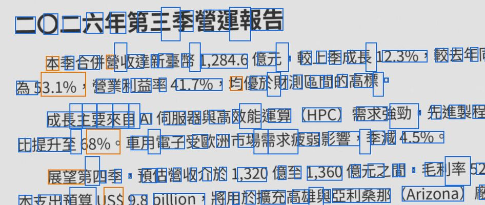
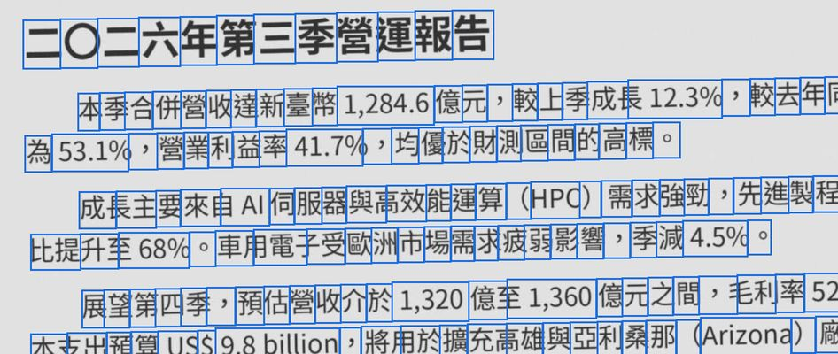

# M3:OCR 引擎比較結果(PaddleOCR vs tesseract.js)

> 對應 [`ROADMAP.md`](ROADMAP.md) §4.1、§4.3。原型與重現方式見 [`spike/ocr/`](../spike/ocr/README.md)。
> 測試日期 2026-09-29。

## 結論

**M4 採用 PaddleOCR(PP-OCRv5 mobile + onnxruntime-web),不採用 tesseract.js。**

| 評估項目 | PaddleOCR | tesseract.js(最好的設定) | 勝出 |
|---|---|---|---|
| 字元錯誤率(CER,全部 24 頁) | **3.3–3.9%** | 13.5% | PaddleOCR(錯字約少 3.5 倍) |
| CER(排除表格頁) | 3.5–3.9% | 6.4% | PaddleOCR |
| 有框線的表格 | 1.6–3.4% | 約 75%(數字欄整欄漏掉) | PaddleOCR |
| 低解析度模糊頁(150 dpi) | 7.5% | **3.8%** | tesseract.js |
| 字詞座標(可搜尋 PDF 需要) | 逐字的框,整齊對齊 | 中文字詞框大小錯亂、常漏框 | PaddleOCR |
| 每頁時間(中位數) | 3.4–4.6 秒 | 3.1 秒 | 相近 |
| 單檔大小 | 22.2 MB(int8)/ 29.8 MB | 8.2 MB | tesseract.js |
| `file://` 離線單檔 | ✅(也可在 Worker 內執行) | ✅(需修補一個 bug) | 相同 |

兩者都完成了 spike 的標準:在 `file://` 下、封鎖所有網路,辨識繁中頁面並取得字詞座標。
所有測試都沒有任何對外網路請求。

準確度與座標品質是「繁中優先」工具的核心價值,而 PaddleOCR 的體積代價比預估小(完整版約 25 MB,ROADMAP 原估 35–40 MB)。
tesseract.js 只在低解析度模糊頁比較好,但整體錯字多 3.5 倍、表格失敗、座標不可靠,
不值得另外維護一個「輕量 OCR」版本。引擎介面(§4.1 `OcrEngine`)仍保留,之後要換引擎不影響 UI 與輸出。

## 測試方法

**測試集**(`spike/ocr/testset.py`):自行撰寫的繁中內容,6 種版面 × 4 種影像品質 = 24 張 A4、300 dpi 的頁面圖,每種品質 1,628 字。

| 版面 | 內容 | 字型 |
|---|---|---|
| contract-serif | 租賃契約(數字大寫、國字日期) | Noto Serif CJK TC(明體)12pt |
| report-sans | 營運報告(中英數混排、百分比、金額) | Noto Sans CJK TC(黑體)10.5pt |
| notice-kai | 社區公告(電話號碼) | AR PL UKai TW(楷體)14pt |
| fine-ming-8pt | 活動注意事項(網址、法律用語) | AR PL UMing TW(明體)**8pt 小字** |
| table-sans | 有框線的採購明細表(數字靠右) | Noto Sans CJK TC 11pt |
| twocol-sans | 雙欄新聞 | Noto Sans CJK TC 10pt |

| 品質 | 模擬方式 |
|---|---|
| clean | 直接渲染 |
| scan | 歪斜 1.2°、紙張灰底、模糊、雜訊、JPEG 品質 45 |
| lowres | 150 dpi 掃描(JPEG)再放大回 300 dpi(相當於 pdf.js 以 300 dpi 渲染低解析度掃描檔) |
| fax | 約 200 dpi、二值化、鋸齒 |

**CER 算法**(`spike/ocr/bench.py`):
- 文字先做 NFKC 正規化(全形英數與逗號視同半形),並去掉空白;空白屬於版面重建,不算辨識錯誤。
- 每個辨識出的字詞依中心點歸到標準答案的某一行,所以座標錯誤也會反映在 CER 上。
- 同一行內依 x 排序後計算編輯距離;沒有歸到任何一行的字全部算錯。

**環境**:Chromium 141(headless)、Intel Xeon 2.1 GHz 雲端主機。兩者都是單執行緒 WASM:`file://` 下沒有 SharedArrayBuffer,無法多執行緒。
一般桌機的單核速度通常較快,實際時間應該更短。

## 結果

### 字元錯誤率(CER)

| 設定 | clean | scan | lowres | fax | **全部** | 排除表格頁 |
|---|---|---|---|---|---|---|
| tesseract.js `tessdata_fast` | 14.4% | 20.1% | 10.7% | 26.9% | **18.0%** | 11.5% |
| tesseract.js `4.0.0_best_int`(tesseract.js 預設) | 14.1% | 11.9% | 12.1% | 16.0% | **13.5%** | 6.4% |
| tesseract.js `tessdata_best` | 14.9% | 12.3% | 12.0% | 16.5% | **13.9%** | 6.9% |
| tesseract.js fast + PSM 6(單一文字區塊) | 12.7% | 12.8% | 16.3% | 18.5% | **15.1%** | 8.2% |
| PaddleOCR(偵測長邊 1600) | 0.9% | 4.0% | 7.5% | 3.1% | **3.9%** | 3.9% |
| PaddleOCR 偵測長邊 960 | 0.9% | 2.5% | 7.0% | 2.7% | **3.3%** | 3.5% |
| PaddleOCR 偵測長邊 2400 | 0.6% | 3.1% | 6.7% | 3.4% | **3.5%** | 3.5% |
| PaddleOCR int8 辨識模型 | 0.9% | 4.1% | 7.4% | 3.1% | **3.9%** | 3.9% |
| PaddleOCR unclip 1.2 | 0.9% | 6.0% | 4.5% | 3.5% | **3.7%** | 3.8% |
| PaddleOCR 銳化 | 1.3% | 5.1% | 4.6% | 3.4% | **3.6%** | 3.7% |
| PaddleOCR unclip 1.2 + 銳化 | 1.2% | 6.3% | 2.5% | 3.4% | **3.3%** | 3.4% |

依版面(四種品質合計):

| 版面 | tess fast | tess best_int | tess best | Paddle | Paddle 960 | Paddle int8 |
|---|---|---|---|---|---|---|
| contract-serif | 5.2% | 4.6% | 4.9% | 5.0% | 4.1% | 5.1% |
| fine-ming-8pt | 18.6% | 9.2% | 9.6% | 5.9% | 5.6% | 6.0% |
| notice-kai | 9.3% | 6.0% | 6.2% | 1.4% | 0.5% | 1.1% |
| report-sans | 12.0% | 5.6% | 6.3% | 2.5% | 2.8% | 2.5% |
| table-sans | 75.3% | 75.7% | 75.4% | 3.4% | 1.6% | 3.4% |
| twocol-sans | 10.4% | 6.2% | 6.9% | 2.6% | 2.0% | 2.6% |

**tesseract.js 的錯誤型態**
- 整行被認成亂碼英文,例如「展望第四季,預估營收介於」→「BYSOS>FAPSUTH」。乾淨的頁面也會發生,所以 clean 反而比 lowres 差。
- 有框線的表格:版面分析被框線打亂,數字欄整欄消失。四種設定都一樣,改成 PSM 6 也沒有改善。
- 常見錯字:「颱」→「屹/賂/孢」、「%」→「9%/0%」、全形標點變成半形或多出「。」。

**PaddleOCR 的錯誤型態**
- 模糊的低解析度頁會**漏掉筆畫少的字**(一、二、日、月、自),例如「自民國一一五年十月一日起」→「民國五年起」。
- 用 Python onnxruntime 對同一張裁切圖也得到相同結果,確認是模型本身的特性,不是 JS 前後處理的錯。
- 把文字框收緊(unclip 1.2)或辨識前銳化,可以改善 lowres(7.5% → 2.5%),但 scan 會變差。整體差異在這個測試集的誤差範圍內,M4 先用 PaddleOCR 預設值。
- 8pt 小字與傳真品質偶爾出現簡體字(稅→税、額→额、兌→兑)。PP-OCRv5 同一個模型涵蓋繁簡,M4 可以考慮加一個「簡轉繁」的後處理,只套用在繁中頁面上。

### 字詞座標

同一張掃描頁(scan 品質)的辨識框;藍色是字詞,橘色是信心值 < 60:

| tesseract.js(best_int) | PaddleOCR |
|---|---|
|  |  |

- **tesseract.js**:中文「字詞」的框大小錯亂,有的只包住半個字、有的跨好幾個字,很多字沒有框。直接拿來做可搜尋 PDF(M5)的隱形文字層,選取與搜尋的位置會偏掉。
- **PaddleOCR**:偵測模型只給「行」的框,逐字位置由 CTC 解碼的時間步推算(ROADMAP §4.1 提到的做法)。實作後每個字的框都整齊對齊,英數字詞也正確合併成一個詞。

### 速度、記憶體、體積

| 設定 | 每頁(中位數) | 最慢一頁 | 開檔 + 初始化 | 記憶體峰值* | 單檔 HTML |
|---|---|---|---|---|---|
| tesseract.js fast | 2.6 秒 | 4.1 秒 | 0.6 秒 | 1.38 GB | 6.9 MB |
| tesseract.js best_int | 3.1 秒 | 5.0 秒 | 0.6 秒 | 1.37 GB | 8.2 MB |
| tesseract.js best | 4.6 秒 | 7.8 秒 | 1.2 秒 | 1.44 GB | 35.1 MB |
| PaddleOCR 1600(偵測 1.7 s + 辨識 2.9 s) | 4.6 秒 | 7.1 秒 | 1.3 秒 | 1.46 GB | 29.8 MB |
| PaddleOCR 960(偵測 0.6 s + 辨識 2.7 s) | 3.4 秒 | 4.6 秒 | 1.1 秒 | 1.32 GB | 29.8 MB |
| PaddleOCR 2400 | 7.1 秒 | 8.1 秒 | 1.3 秒 | 1.90 GB | 29.8 MB |
| PaddleOCR int8 | 4.5 秒 | 5.7 秒 | 1.0 秒 | 1.50 GB | **22.2 MB** |

\* 所有 Chromium 行程的 RSS 加總(會重複計算共用記憶體,只適合互相比較)。同樣的量法下,空白頁約 0.37 GB、PDF 工作台約 0.48 GB,所以 OCR 辨識一頁 A4 時約再多用 0.9–1 GB,兩種引擎相近。

**體積明細**(原始大小 → gzip 後;HTML 內再以 base64 內嵌,約多 33%):

| 元件 | 原始 | gzip |
|---|---|---|
| onnxruntime-web WASM(1.30.0) | 14.2 MB | 3.7 MB |
| PP-OCRv5 mobile 偵測模型 | 4.9 MB | 4.6 MB |
| PP-OCRv5 mobile 辨識模型(float32) | 16.6 MB | 14.0 MB |
| 辨識模型(MatMul 權重逐通道 int8) | 9.3 MB | 8.3 MB |
| tesseract.js core(SIMD、LSTM) | 4.0 MB | 1.5 MB |
| `chi_tra` + `eng`(fast / best_int / best) | 6.5 / 7.6 / 28.4 MB | 3.6 / 4.6 / 24.8 MB |

- **gzip + `DecompressionStream`**:內嵌前先 gzip,執行時用瀏覽器內建的 `DecompressionStream` 解壓。ONNX Runtime 的 WASM 因此從 14 MB 變成 3.7 MB。體積比 ROADMAP 的估計小很多:原估 PaddleOCR 35–40 MB、tesseract 10–15 MB。
- **int8 量化**:只量化 MatMul 權重(逐通道)時,準確度與 float32 相同(3.9%),單檔從 29.8 MB 降到 22.2 MB。如果連卷積一起量化(預設的 `quantize_dynamic`),準確度明顯下降:用標準答案的行框直接測辨識模型,乾淨頁的 CER 從 0.9% 升到 7.6%,不可用。
- **預估**:完整版 = 目前約 3 MB + PaddleOCR int8 約 22 MB ≈ **25 MB**。

## 離線整合的發現(M4 直接沿用)

- **onnxruntime-web**:把 WASM 用 `env.wasm.wasmBinary` 直接傳入,Emscripten 膠水模組(`.mjs`)用 Blob URL 動態 import,`numThreads = 1`。
  - 已驗證可以在 `file://` 的 Blob **Worker** 內執行,Worker 內也有 OffscreenCanvas。M4 要把整個流程(偵測、裁切、辨識)放進 Worker,否則每頁 3–5 秒會卡住畫面。原型目前在主執行緒執行。
- **tesseract.js**:
  - `file://` 下的 worker 無法 `importScripts` 頁面建立的另一個 Blob URL,所以要把 core 與 worker 腳本串成同一個 Blob。
  - 語言檔可以用 `{ code, data }` 直接傳入,不需要攔截 fetch。但 tesseract.js 7.0.0 在這種用法下,初始化會誤把資料當成語言名稱,必須修補 worker 腳本。
- **PaddleOCR 前後處理**:在瀏覽器端沒有現成的成熟套件,自己寫的部分(約 250 行)如下:
  - 偵測:DB 後處理(連通區域 → 主成分方向的旋轉外框 → unclip)
  - 辨識:依旋轉外框裁切並轉正(處理歪斜掃描)、CTC 解碼、由時間步推算逐字座標
  - 直書的框(高 ≥ 寬 × 1.5)會先轉 90° 再辨識,但**尚未用直書文件測試**
- **模型來源**:
  - PP-OCRv5 mobile 的 ONNX/ORT 檔取自 npm 套件 `pdfmarkdown-ppocrv5-models`(Apache-2.0,轉自 `ppu-paddle-ocr-models`)。
  - 字典已與 PaddleOCR 官方 `ppocrv5_dict.txt` 逐行比對:套件版本多了第 2 行空白與結尾空白,建置時已還原成官方順序。
  - 權重本身沒能和官方 Paddle 模型比對(這個環境連不到 Hugging Face 與百度的下載站)。M4 若能取得官方模型,應自行轉檔並比對輸出。

## 限制與 M4 待辦

1. **測試集是合成的**:字型直接渲染,再模擬掃描、低解析度、傳真。M4 應加入真實掃描檔,例如使用者提供的文件,但不可進版控;也可以找公開授權的掃描樣本。
2. **只測了 Chromium**:`DecompressionStream`(Firefox 113+、Safari 16.4+)、Blob URL 動態 import、Worker 內的 onnxruntime 都要在 Firefox 與 Safari 確認。
3. **參數**:
   - 偵測長邊 960 最快、準確度也最好,但測試集只有 A4 單頁。M4 建議先用 1280,再用真實文件調整。
   - unclip、銳化先維持 PaddleOCR 預設值。
4. **低解析度模糊頁**是 PaddleOCR 的弱點。可以考慮偵測到模糊時,自動改用收緊的框或銳化,但要先用真實文件驗證。
5. **簡體字輸出**:小字與傳真偶爾出現簡體字,可以加簡轉繁的後處理(只轉有把握的一對一字)。
6. **直書、手寫、印章**:沒有測試。
